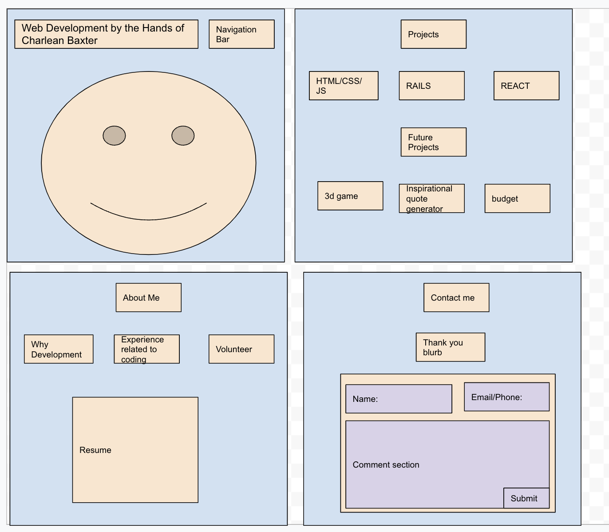

## portfolio-sample
This project is an approach to building a web development portfolio with html, css, and js.

- Resources used:
  - [w3schools](w3schools.com) for portfolio html, css, js
  - [craiyon](https://www.craiyon.com/) for animation of web developer
  - [bootstrap](https://getbootstrap.com/docs/5.3/getting-started/introduction/) for navigation bar

- Goal for portfolio design: 
  - [dark template from w3schools](https://www.w3schools.com/howto/tryit.asp?filename=tryw3css_templates_dark_portfolio&stacked=h)  
  - Responsive design
  - Footer with github and linkedIn
  - Make a collapsible navbar
  - [online resume](https://www.w3schools.com/HOWTO/howto_website_create_resume.asp)
  - Add color to accordion
  - Add animation on home and contact sections
  - unique font for heading text

## Wireframe
There are many websites available for wireframing. I used a simple sketch to brainstorm an idea. [Google Drawing](https://docs.google.com/drawings/)
  

## Process taken to create portfolio using html, css, js
1. Create html file
  - Type `html`; Select the html5 option to receive the boilerplate to begin html file

2. Create a boilerplate or layout for the content you want to include for portfolio
  - Home
  - About Me
  - Projects
  - Contact Me

3. Create an assets folder to store videos and images of data you want displayed for each section.
- screenshots: `shift + command + 4`
- videos: `shift + command + 5`

The code presently on the files are refactored work to show a navigation bar and accordion emphasis for topics using bootstrap.  
The original code is the following:

```html
<!DOCTYPE html>
<html lang="en">
<head>
  <meta charset="UTF-8">
  <meta http-equiv="X-UA-Compatible" content="IE=edge">
  <meta name="viewport" content="width=device-width, initial-scale=1.0">
  <title>Developer Charlean Baxter</title>
  <link rel="stylesheet" href="sample.css"/>
</head>
<body>
  <!-- navigation bar -->
  <div class="bar">
    <a href="#about">About Me</a>
    <a href="#projects">Projects</a>
    <a href="#contact">Contact</a>
    <h1>Web Development by the hands of Charlean Baxter</h1>
  </div>
  

  <!-- about -->
  <div class="about-sect">
    <h2 id="about">About Me</h2>
    <h3>Why Development</h3>
    <p>Lorem ipsum, dolor sit amet consectetur adipisicing elit. Perspiciatis corporis nulla deleniti, beatae maxime repellendus explicabo ducimus, quo ex est repudiandae quibusdam in laborum itaque natus incidunt ab alias aut dicta fugit magni illum, debitis atque. Impedit quia quasi aliquam odit rerum quo perferendis debitis, in fugit tempore a animi, quis eius quaerat, quae laudantium rem iste possimus consequuntur provident. Suscipit at mollitia ipsa similique provident porro accusamus cumque maxime eius soluta asperiores ullam earum, iure explicabo fugit, optio corrupti illo ea, consequuntur ut rem sunt saepe possimus? Asperiores vero eveniet repellendus et quis voluptatibus, quaerat ipsam ex eaque inventore?</p>
    <h3>Previous Experience</h3>
    <h3>Volunteer</h3>
  </div>

  <!-- projects -->
  <h2 id="projects">Projects</h2>
  <h3>HTML/CSS/JS</h3>
  <h3>Rails</h3>
  <h3>React</h3>
  <video height="300" width="300" controls>
    <source src="assets/react-joke-app.mp4" type="video/mp4"/>
  </video> 

  <h2>Future Projects</h2>
  <h3>3d game</h3>  
  <h3>inspirational quote generator</h3>  
  <h3>budget planner</h3>

  <!-- contact -->
  <h2 id="contact">Contact Me</h2>
  <h3>Thank you section</h3>
  <h3>Contact form</h3>

</body>
</html>
```

